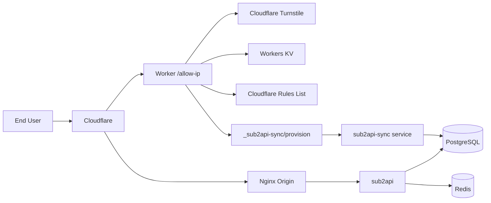

# sub2api-gate

[中文版](README.zh-CN.md)

Self-hosted API gateway with Cloudflare-based IP access control. One `docker compose up` gets you a full stack: API gateway, PostgreSQL, Redis, Nginx reverse proxy, and a Cloudflare Worker that manages who can access your API.

## What it does

Users visit your `/allow-ip` page, solve a Turnstile challenge, and get their IP added to a Cloudflare allowlist. From there, they can call your OpenAI-compatible API normally. An admin panel on the Worker lets you manage users, API keys, and subscriptions.

- OpenAI-compatible gateway (sub2api)
- Turnstile-protected IP allowlisting
- Invite-key / UUID based access
- IPv4 `/24` and IPv6 `/128` granularity
- Admin panel hosted on Cloudflare Workers
- Automatic user and API key provisioning
- Default group and subscription assignment

## How it fits together



API traffic goes `Cloudflare -> Nginx -> sub2api`. Admin and access-control operations go `Cloudflare Worker -> sync service -> PostgreSQL`.

## Tech stack

| Layer | Technology |
|-------|-----------|
| API gateway | [sub2api](https://github.com/sub2api/sub2api) (OpenAI-compatible) |
| Database | PostgreSQL 18 |
| Cache | Redis 8 |
| Reverse proxy | Nginx (Cloudflare origin) |
| Edge compute | Cloudflare Workers |
| KV store | Workers KV (invite keys) |
| Access control | Cloudflare Rules List + WAF |
| Bot protection | Cloudflare Turnstile |
| Sync service | Python 3 (stdlib only, no dependencies) |
| Orchestration | Docker Compose |
| Service management | systemd |

## What's in the repo

```
docker-compose.yml          sub2api + PostgreSQL + Redis
nginx/                      Nginx configs + Cloudflare IP updater script
sub2api-sync/               Origin-side provisioning service (Python)
worker-allow-ip/            Cloudflare Worker source
demo/                       Static HTML demo you can open in a browser
.env.example                Environment variable template
```

## Deploy

### Prerequisites

- Linux host with Docker + Docker Compose
- A domain (e.g. `api.example.com`) proxied through Cloudflare
- A Cloudflare account with Turnstile and Rules Lists enabled

### 1. Start the stack

```bash
cp .env.example .env
# Edit .env — at minimum set POSTGRES_PASSWORD, ADMIN_PASSWORD, JWT_SECRET
mkdir -p data postgres_data redis_data
docker compose up -d
docker compose ps
```

### 2. Configure Nginx

The configs in `nginx/` are templates with `api.example.com` as a placeholder. Replace it with your domain, update certificate paths, then:

```bash
# Refresh Cloudflare IP allowlists
bash nginx/update-cloudflare-ips.sh

# Test and reload
nginx -t && systemctl reload nginx
```

### 3. Deploy the sync service

This Python service sits between the Worker and your database, translating user changes into Sub2API records.

```bash
# Copy files
sudo mkdir -p /opt/sub2api-sync
sudo cp sub2api-sync/sub2api_sync.py /opt/sub2api-sync/
sudo cp sub2api-sync/sub2api-sync.service /etc/systemd/system/

# Create env file at /etc/sub2api-sync.env with:
#   SUB2API_SYNC_SECRET=<random string, 32+ chars>
#   SUB2API_PUBLIC_BASE_URL=https://your-domain/v1
#   SUB2API_LOGIN_URL=https://your-domain
#   SUB2API_INTERNAL_LOGIN_URL=http://127.0.0.1:8080/api/v1/auth/login
#   POSTGRES_USER=sub2api
#   POSTGRES_DB=sub2api

sudo systemctl daemon-reload
sudo systemctl enable --now sub2api-sync
```

### 4. Deploy the Cloudflare Worker

```bash
cd worker-allow-ip
npm install
```

Edit `wrangler.jsonc`:

| Field | Replace with |
|-------|-------------|
| `ACCOUNT_ID` | Your Cloudflare account ID |
| `IP_LIST_ID` | Rules List ID for IP allowlisting |
| `YOUR_KV_NAMESPACE_ID` | KV namespace for storing invite keys |
| `TURNSTILE_SITE_KEY` | From your Turnstile widget settings |
| `route` / `ALLOWED_HOSTNAMES` | Your domain |
| `SUB2API_DEFAULT_BASE_URL` | `https://your-domain/v1` |
| `SUB2API_SYNC_URL` | `https://your-domain/_sub2api-sync/provision` |

Set secrets (stored in Cloudflare, never in files):

```bash
npx wrangler secret put TURNSTILE_SECRET_KEY
npx wrangler secret put CLOUDFLARE_API_TOKEN
npx wrangler secret put ADMIN_PASSWORD_HASH   # SHA-256 hex digest
npx wrangler secret put ADMIN_TOTP_SECRET
npx wrangler secret put SUB2API_SYNC_SECRET
npx wrangler secret put INVITE_KEYS            # optional fallback
```

Deploy:

```bash
npx wrangler deploy
```

### 5. Set up Cloudflare WAF

Create a WAF custom rule that blocks requests to your API unless the client IP is in your allowlist:

```text
(http.host eq "api.example.com"
 and not starts_with(http.request.uri.path, "/allow-ip")
 and not ip.src in $your_allowlist_name)
```

Action: **Block**

## Demo

Open [demo/index.html](demo/index.html) in a browser to see a mock version of the allow-ip flow and admin panel. No backend needed — it's all static HTML/JS. You can also deploy it to GitHub Pages or Cloudflare Pages.

## Security

- All secrets are injected via environment variables or Cloudflare Worker secrets — nothing is hardcoded
- The sync service validates every request with HMAC signatures and nonce replay protection
- Authenticated Origin Pulls is recommended for the Nginx config
- See [SECURITY.md](SECURITY.md) if you find a vulnerability

## License

MIT
