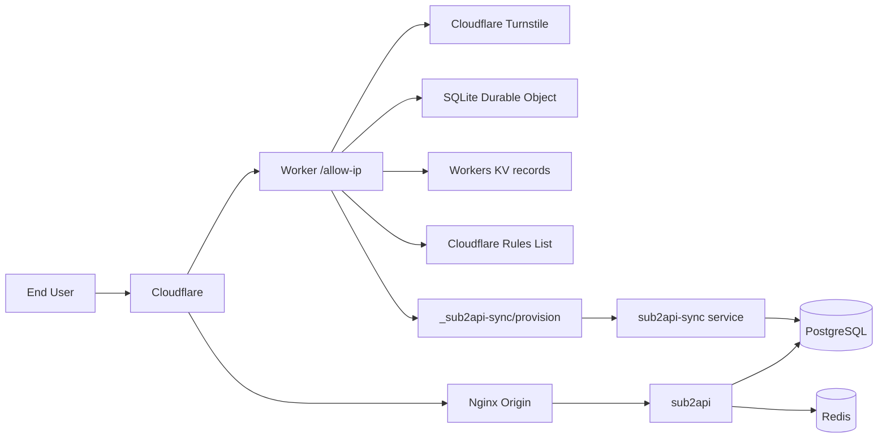

# sub2api-gate

[中文版](README.zh-CN.md)

Self-hosted API gateway with Cloudflare-based IP access control. Docker Compose
manages Sub2API, PostgreSQL 18, Redis 8.8, and the provisioning sync service.
Nginx remains a host service and the access UI runs as a separately published
Cloudflare Worker.

## What it does

Users visit your `/allow-ip` page, solve a Turnstile challenge, and get their IP added to a Cloudflare allowlist. From there, they can call your OpenAI-compatible API normally. An admin panel on the Worker lets you manage users, API keys, and subscriptions.

- OpenAI-compatible gateway (sub2api)
- Turnstile-protected IP allowlisting
- One-time invite access keys, with a seven-day legacy UUID transition
- IPv4 `/24` and IPv6 `/128` granularity
- Admin panel hosted on Cloudflare Workers
- Automatic user and API key provisioning
- `openai-default` group and subscription assignment

## How it fits together



API traffic goes `Cloudflare -> Nginx -> sub2api`. Admin and access-control operations go `Cloudflare Worker -> sync service -> PostgreSQL`.

## Tech stack

| Layer | Technology |
|-------|-----------|
| API gateway | [sub2api](https://github.com/sub2api/sub2api) (OpenAI-compatible) |
| Database | PostgreSQL 18 |
| Cache | Redis 8.8.0 |
| Reverse proxy | Nginx (Cloudflare origin) |
| Edge compute | Cloudflare Workers |
| Strong auth state | SQLite Durable Object (invites, trash, sessions) |
| KV store | Workers KV (`records:*` IP groups; one-time migration source only) |
| Access control | Cloudflare Rules List + WAF |
| Bot protection | Cloudflare Turnstile |
| Sync service | Python 3 (stdlib only, no dependencies) |
| Container orchestration | Docker Compose (Sub2API, PostgreSQL, Redis, sync) |
| Edge/origin services | Cloudflare Worker and host Nginx, deployed separately |

## What's in the repo

```
docker-compose.yml          sub2api + PostgreSQL + Redis + sync service
nginx/                      Nginx configs + Cloudflare IP updater script
sub2api-sync/               Origin-side provisioning service (Python)
worker-allow-ip/            Cloudflare Worker source
demo/                       Static HTML demo you can open in a browser
.env.example                Environment variable template
```

## Deploy

### Prerequisites

- Linux host with Docker + Docker Compose
- A domain (e.g. `api.example.com`) proxied through Cloudflare
- A Cloudflare account with Turnstile and Rules Lists enabled

### 1. Prepare the stack

```bash
cp .env.example .env
chmod 600 .env
# Replace every `replace-with...` value and set the approved HTTPS URLs/hosts.
docker compose config --no-interpolate
```

After production approval, pre-create the fail-closed persistent layout on the
target host. Compose will not create a missing bind source:

```bash
sudo install -d -o root -g root -m 0700 /mnt/data/sub2api-gate
sudo install -d -o 1000 -g 1000 -m 0700 /mnt/data/sub2api-gate/app
sudo install -d -o 70 -g 70 -m 0700 /mnt/data/sub2api-gate/postgres
sudo install -d -o 999 -g 1000 -m 0700 /mnt/data/sub2api-gate/redis
sudo install -d -o 999 -g 1000 -m 0700 /mnt/data/sub2api-gate/redis/nonce
sudo install -d -o root -g root -m 0700 /mnt/data/sub2api-gate/safe-backup
sudo install -d -o root -g root -m 0700 /mnt/data/sub2api-gate/exports
bash deploy/security-preflight.sh check --env-file .env
```

The preflight requires at least the configured 10 GiB free-space floor on this
filesystem and refuses active host swap. Compose also disables core dumps for
every runtime so volatile Redis state cannot be retained through swap or crash
dumps. Bare-metal Nginx additionally requires the tracked systemd `LimitCORE=0`
drop-in and a controlled restart; the preflight verifies every live Nginx
process through `/proc`.

Do not start or replace production services from this quick guide. Follow the
ordered, rollback-aware checklist in [deploy/README.md](deploy/README.md).

### 2. Configure Nginx

The configs in `nginx/` are templates with `api.example.com` as a placeholder. Replace it with your domain, update certificate paths, then:

```bash
# Refresh Cloudflare IP allowlists
bash nginx/update-cloudflare-ips.sh check

# Test and reload
nginx -t && systemctl reload nginx
```

### 3. Prepare the sync service

The sync service runs as a non-root, read-only container. Its PostgreSQL 18
client and Python sources are digest-pinned and the Dockerfile performs no
package-manager install. Runtime Compose can neither build nor pull the image.
The service uses the dedicated `sub2api_sync` database role and is published
only on `127.0.0.1:3021`.

```bash
# Local checks only; release preparation is documented in deploy/README.md.
python3 deploy/sync-canary.py check
docker build --network none --tag sub2api-gate/sub2api-sync:local-test sub2api-sync
docker run --rm --pull never --network none --read-only \
  --entrypoint psql sub2api-gate/sub2api-sync:local-test --version
python3 -m unittest discover -s sub2api-sync/tests -v
```

### Local verification gate

The complete local verification gate uses no production credentials or private
Worker configuration. It runs the high-severity dependency audit, Worker and
sync coverage ratchets, guarded release-tool coverage, isolated PostgreSQL/Redis
dependency tests, browser UI contracts, release-policy consistency, and
whitespace validation. Docker is required for the isolated dependency tests.

```bash
(cd worker-allow-ip && npm ci && npx playwright install chromium)
bash deploy/verify-local.sh
```

GitHub Actions runs the same gate for pull requests and pushes. The temporary
PostgreSQL and Redis containers use fixed image digests, loopback-only Redis,
test-only credentials, and exact-name cleanup. A live administrator recovery
proof remains a private-TTY production gate and is intentionally not automated.

### 4. Deploy the Cloudflare Worker

```bash
(cd worker-allow-ip && npm ci)
```

Create the ignored `wrangler.private.jsonc` from the tracked template and edit only that private file:

```bash
cp worker-allow-ip/wrangler.jsonc worker-allow-ip/wrangler.private.jsonc
chmod 600 worker-allow-ip/wrangler.private.jsonc
```

| Field | Replace with |
|-------|-------------|
| `ACCOUNT_ID` | Your Cloudflare account ID |
| `IP_LIST_ID` | Rules List ID for IP allowlisting |
| `YOUR_KV_NAMESPACE_ID` | KV namespace for `records:*` IP groups and one-time legacy migration |
| `TURNSTILE_SITE_KEY` | From your Turnstile widget settings |
| `route` / `ALLOWED_HOSTNAMES` | Your domain |
| `PROVIDER_ALLOWED_HOSTNAMES` | At least one approved external API provider hostname; keep disjoint from `ALLOWED_HOSTNAMES` and set real values only in the ignored private file |
| `SUB2API_DEFAULT_BASE_URL` | `https://your-domain/v1` |
| `SUB2API_SYNC_URL` | `https://your-domain/_sub2api-sync/provision` |
| `GEOIP_LOOKUP_URL` | Optional HTTPS template containing exactly one `{ip}`; leave empty to disable third-party lookup |
| `GEOIP_ALLOWED_HOSTNAMES` | Separate comma-delimited hostname allowlist required whenever `GEOIP_LOOKUP_URL` is set |

Third-party GeoIP is disabled by default. When both optional fields are empty,
the Worker uses only Cloudflare `request.cf` location metadata, adds no external
request latency, and does not disclose the visitor IP to another provider.
The public gateway hostname is never a provider hostname. Leave the tracked
provider list empty; add reviewed production provider hosts only to
`wrangler.private.jsonc`. The empty tracked value is intentionally not
deployable; local preflight and the Worker runtime both fail closed until the
private list contains at least one valid, disjoint hostname.

Set runtime secrets in Cloudflare. The HMAC initializer uses one narrowly scoped
temporary file only for the later one-time comment migration:

Initialize only missing managed values. A new HMAC is temporarily staged in a
operator-only ignored file so the later comment migration uses the exact uploaded
value:

```bash
python3 deploy/generate-worker-secrets.py check
python3 deploy/generate-worker-secrets.py --apply  # Only after approval, in a private terminal
```

The apply command reads remote Secret names, never overwrites an existing
administrator password, AES key, or HMAC key, sends all missing values in one
bulk stdin request, and verifies names afterward. The temporary HMAC file is
owned by the deployment operator with mode `0600`, contains no other credential,
is ignored by Git, and is removed only after the Cloudflare comment migration
verifies its remote result.
Do not rotate those three values with `wrangler secret put`; rotation requires
a credential migration.

```bash
(cd worker-allow-ip && npx wrangler secret put TURNSTILE_SECRET_KEY --config wrangler.private.jsonc)
(cd worker-allow-ip && npx wrangler secret put CLOUDFLARE_API_TOKEN --config wrangler.private.jsonc)
(cd worker-allow-ip && npx wrangler secret put ADMIN_TOTP_SECRET --config wrangler.private.jsonc) # 16-128 Base32 characters
(cd worker-allow-ip && npx wrangler secret put SUB2API_SYNC_SECRET --config wrangler.private.jsonc)
```

Validate locally first:

```bash
(cd worker-allow-ip && npm run deploy:dry-run)
```

Run `(cd worker-allow-ip && npm run deploy:apply)` only after explicit
deployment approval. Plain `npm run deploy` is check-only and cannot publish
the Worker.
Check/dry-run does not query Cloudflare for secret presence and reports that
state explicitly. The apply path lists only secret names, suppresses the
returned list, and stops before publishing if a required Worker Secret is
missing; it never receives or prints secret values.

### 5. Set up Cloudflare WAF

Create a WAF custom rule that blocks requests to your API unless the client IP is in your allowlist:

```text
(http.host eq "api.example.com"
 and not starts_with(http.request.uri.path, "/allow-ip")
 and not ip.src in $your_allowlist_name)
```

Action: **Block**

## Demo

Open [demo/index.html](demo/index.html) in a browser to see a mock version of the allow-ip flow and admin panel. No backend needed — it's all static HTML/JS. You can also deploy it to GitHub Pages or Cloudflare Pages.

## Security

- All secrets are injected via environment variables or Cloudflare Worker secrets — nothing is hardcoded
- The sync service validates every request with HMAC signatures and nonce replay protection
- Conversation request/response content is never mirrored to sync or retained in the inspector
- Admin login rate-limit identifiers are domain-separated HMAC fingerprints in
  a strongly consistent Durable Object
- Per-hostname Authenticated Origin Pulls is required before final origin lock-down
- See [SECURITY.md](SECURITY.md) if you find a vulnerability

## License

MIT
