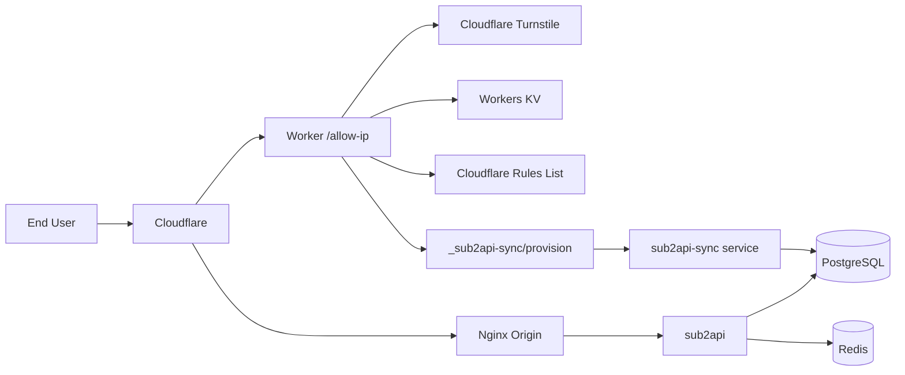

# sub2api-gate

[English](README.md)

自托管的 API 网关方案，基于 Cloudflare 实现 IP 白名单准入控制。`docker compose up` 一条命令拉起完整环境：API 网关、PostgreSQL、Redis、Nginx 反向代理，以及一个 Cloudflare Worker 来管理谁能访问你的 API。

## 它能做什么

用户访问 `/allow-ip` 页面，通过 Turnstile 人机验证后，IP 自动加入 Cloudflare 白名单，之后就可以正常调用 OpenAI 兼容的 API。Worker 上托管了管理后台，可以管理用户、API Key 和订阅。

- OpenAI 兼容网关（sub2api）
- Turnstile 验证保护的 IP 准入
- 邀请码 / UUID 访问机制
- IPv4 `/24`、IPv6 `/128` 粒度白名单
- Worker 托管的管理后台
- 用户和 API Key 自动同步
- 默认分组和订阅自动分配

## 架构



API 请求走 `Cloudflare -> Nginx -> sub2api`，准入和管理操作走 `Cloudflare Worker -> sync service -> PostgreSQL`。

## 技术栈

| 层级 | 技术 |
|------|------|
| API 网关 | [sub2api](https://github.com/sub2api/sub2api)（OpenAI 兼容） |
| 数据库 | PostgreSQL 18 |
| 缓存 | Redis 8 |
| 反向代理 | Nginx（Cloudflare 回源） |
| 边缘计算 | Cloudflare Workers |
| KV 存储 | Workers KV（邀请码） |
| 访问控制 | Cloudflare Rules List + WAF |
| 人机验证 | Cloudflare Turnstile |
| 同步服务 | Python 3（纯标准库，无第三方依赖） |
| 容器编排 | Docker Compose |
| 服务管理 | systemd |

## 目录结构

```
docker-compose.yml          sub2api + PostgreSQL + Redis
nginx/                      Nginx 配置 + Cloudflare IP 更新脚本
sub2api-sync/               源站同步服务（Python）
worker-allow-ip/            Cloudflare Worker 代码
demo/                       纯前端演示页面
.env.example                环境变量模板
```

## 部署

### 前置条件

- Linux 主机，已安装 Docker + Docker Compose
- 一个域名（如 `api.example.com`），已开启 Cloudflare 代理
- Cloudflare 账号，已启用 Turnstile 和 Rules Lists

### 1. 启动服务

```bash
cp .env.example .env
# 编辑 .env，至少设置 POSTGRES_PASSWORD、ADMIN_PASSWORD、JWT_SECRET
mkdir -p data postgres_data redis_data
docker compose up -d
docker compose ps
```

### 2. 配置 Nginx

`nginx/` 下的配置文件用 `api.example.com` 作为占位符，替换成你的域名和证书路径后：

```bash
# 刷新 Cloudflare IP 白名单
bash nginx/update-cloudflare-ips.sh

# 测试并重载
nginx -t && systemctl reload nginx
```

### 3. 部署同步服务

这个 Python 服务负责把 Worker 的用户变更翻译成 Sub2API 数据库操作。

```bash
# 复制文件
sudo mkdir -p /opt/sub2api-sync
sudo cp sub2api-sync/sub2api_sync.py /opt/sub2api-sync/
sudo cp sub2api-sync/sub2api-sync.service /etc/systemd/system/

# 创建环境文件 /etc/sub2api-sync.env：
#   SUB2API_SYNC_SECRET=<随机字符串，32位以上>
#   SUB2API_PUBLIC_BASE_URL=https://你的域名/v1
#   SUB2API_LOGIN_URL=https://你的域名
#   SUB2API_INTERNAL_LOGIN_URL=http://127.0.0.1:8080/api/v1/auth/login
#   POSTGRES_USER=sub2api
#   POSTGRES_DB=sub2api

sudo systemctl daemon-reload
sudo systemctl enable --now sub2api-sync
```

### 4. 部署 Cloudflare Worker

```bash
cd worker-allow-ip
npm install
```

编辑 `wrangler.jsonc`：

| 字段 | 替换为 |
|------|--------|
| `ACCOUNT_ID` | Cloudflare 账户 ID |
| `IP_LIST_ID` | IP 白名单用的 Rules List ID |
| `YOUR_KV_NAMESPACE_ID` | 存储邀请码的 KV 命名空间 |
| `TURNSTILE_SITE_KEY` | Turnstile 小组件的 Site Key |
| `route` / `ALLOWED_HOSTNAMES` | 你的域名 |
| `SUB2API_DEFAULT_BASE_URL` | `https://你的域名/v1` |
| `SUB2API_SYNC_URL` | `https://你的域名/_sub2api-sync/provision` |

设置 secrets（存在 Cloudflare 里，不会写入文件）：

```bash
npx wrangler secret put TURNSTILE_SECRET_KEY
npx wrangler secret put CLOUDFLARE_API_TOKEN
npx wrangler secret put ADMIN_PASSWORD_HASH   # SHA-256 十六进制摘要
npx wrangler secret put ADMIN_TOTP_SECRET
npx wrangler secret put SUB2API_SYNC_SECRET
npx wrangler secret put INVITE_KEYS            # 可选，fallback 邀请码
```

部署：

```bash
npx wrangler deploy
```

### 5. 配置 Cloudflare WAF

创建一条 WAF 自定义规则，只允许白名单内的 IP 访问 API：

```text
(http.host eq "api.example.com"
 and not starts_with(http.request.uri.path, "/allow-ip")
 and not ip.src in $your_allowlist_name)
```

动作：**Block**

## Demo

浏览器直接打开 [demo/index.html](demo/index.html)，可以看到 mock 的准入流程和管理后台，纯静态不需要后端。也可以部署到 GitHub Pages 或 Cloudflare Pages。

## 安全

- 所有密钥通过环境变量或 Cloudflare Worker secrets 注入，没有硬编码
- 同步服务对每个请求做 HMAC 签名 + nonce 防重放校验
- 建议在 Nginx 配置中开启 Authenticated Origin Pulls
- 发现漏洞请提交到 [SECURITY.md](SECURITY.md)

## 许可证

MIT
