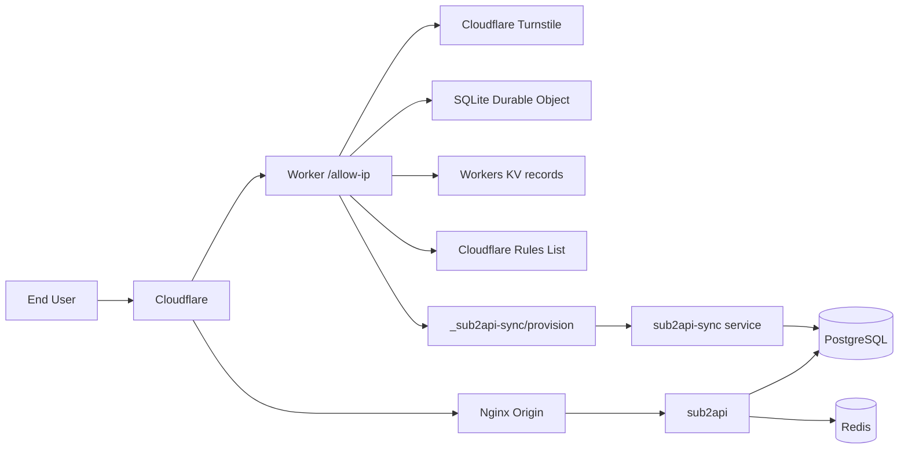

# sub2api-gate

[English](README.md)

自托管的 API 网关方案，基于 Cloudflare 实现 IP 白名单准入控制。Docker
Compose 只管理 Sub2API、PostgreSQL 18、Redis 8.8 和 provisioning sync；
Nginx 仍是宿主机服务，访问页面则由单独发布的 Cloudflare Worker 提供。

## 它能做什么

用户访问 `/allow-ip` 页面，通过 Turnstile 人机验证后，IP 自动加入 Cloudflare 白名单，之后就可以正常调用 OpenAI 兼容的 API。Worker 上托管了管理后台，可以管理用户、API Key 和订阅。

- OpenAI 兼容网关（sub2api）
- Turnstile 验证保护的 IP 准入
- 一次性邀请访问密钥，以及七天旧 UUID 兼容期
- IPv4 `/24`、IPv6 `/128` 粒度白名单
- Worker 托管的管理后台
- 用户和 API Key 自动同步
- `openai-default` 分组和订阅自动分配

## 架构



API 请求走 `Cloudflare -> Nginx -> sub2api`，准入和管理操作走 `Cloudflare Worker -> sync service -> PostgreSQL`。

## 技术栈

| 层级 | 技术 |
|------|------|
| API 网关 | [sub2api](https://github.com/sub2api/sub2api)（OpenAI 兼容） |
| 数据库 | PostgreSQL 18 |
| 缓存 | Redis 8.8.0 |
| 反向代理 | Nginx（Cloudflare 回源） |
| 边缘计算 | Cloudflare Workers |
| 强一致认证状态 | SQLite Durable Object（邀请、回收站、会话） |
| KV 存储 | Workers KV（`records:*` IP 组；仅作一次性迁移源） |
| 访问控制 | Cloudflare Rules List + WAF |
| 人机验证 | Cloudflare Turnstile |
| 同步服务 | Python 3（纯标准库，无第三方依赖） |
| 容器编排 | Docker Compose（Sub2API、PostgreSQL、Redis、sync） |
| 边缘/源站服务 | Cloudflare Worker 与宿主机 Nginx，分别发布 |

## 目录结构

```
docker-compose.yml          sub2api + PostgreSQL + Redis + sync 服务
nginx/                      Nginx 配置 + Cloudflare IP 更新脚本
sub2api-sync/               源站同步服务（Python）
worker-allow-ip/            Cloudflare Worker 代码
demo/                       纯前端演示页面
.env.example                环境变量模板
```

## 部署

### 前置条件

- Linux 主机，已安装 Docker + Docker Compose
- 一个域名（如 `api.example.com`），已开启 Cloudflare 代理
- Cloudflare 账号，已启用 Turnstile 和 Rules Lists

### 1. 准备服务

```bash
cp .env.example .env
chmod 600 .env
# 替换全部 `replace-with...`，并设置已批准的 HTTPS URL/hostname
docker compose config --no-interpolate
```

只有得到生产执行确认后，才在目标主机预创建严格的数据目录。Compose 不会
自动创建缺失的 bind source：

```bash
sudo install -d -o root -g root -m 0700 /mnt/data/sub2api-gate
sudo install -d -o 1000 -g 1000 -m 0700 /mnt/data/sub2api-gate/app
sudo install -d -o 70 -g 70 -m 0700 /mnt/data/sub2api-gate/postgres
sudo install -d -o 999 -g 1000 -m 0700 /mnt/data/sub2api-gate/redis
sudo install -d -o 999 -g 1000 -m 0700 /mnt/data/sub2api-gate/redis/nonce
sudo install -d -o root -g root -m 0700 /mnt/data/sub2api-gate/safe-backup
sudo install -d -o root -g root -m 0700 /mnt/data/sub2api-gate/exports
bash deploy/security-preflight.sh check --env-file .env
```

预检会核对该文件系统实际可用空间，最低门槛为配置的 10 GiB，并拒绝启用
host swap；Compose 同时对全部运行容器禁用 core dump，避免易失 Redis 状态经
swap 或崩溃转储落盘。裸机 Nginx 还必须安装 tracked 的 systemd
`LimitCORE=0` drop-in 并受控重启；预检会通过 `/proc` 核对每个 Nginx 进程。

不要按这份快速说明直接启动或替换生产服务。生产操作必须遵循
[deploy/README.md](deploy/README.md) 中固定的顺序和检查项。

### 2. 配置 Nginx

`nginx/` 下的配置文件用 `api.example.com` 作为占位符，替换成你的域名和证书路径后：

```bash
# 刷新 Cloudflare IP 白名单
bash nginx/update-cloudflare-ips.sh check

# 测试并重载
nginx -t && systemctl reload nginx
```

### 3. 准备同步服务

sync 以非 root、只读根文件系统的容器运行。PostgreSQL 18 client 与
Python 来源均固定 digest，Dockerfile 不执行任何包管理器安装，运行时
Compose 既不能构建也不能拉取镜像。它只使用专用 `sub2api_sync`
数据库角色，并且只发布到 `127.0.0.1:3021`。

```bash
# 仅本地检查；正式镜像准备流程见 deploy/README.md。
python3 deploy/sync-canary.py check
docker build --network none --tag sub2api-gate/sub2api-sync:local-test sub2api-sync
docker run --rm --pull never --network none --read-only \
  --entrypoint psql sub2api-gate/sub2api-sync:local-test --version
python3 -m unittest discover -s sub2api-sync/tests -v
```

### 本地验证门禁

完整门禁不使用生产凭据或 Worker 私有配置，会统一执行高危依赖审计、Worker
和 sync 覆盖率递增门槛、发布工具覆盖率、隔离的 PostgreSQL/Redis 真实依赖测试、
浏览器 UI 合同测试、发布策略一致性和空白检查。隔离依赖测试需要 Docker；GitHub
Actions 对 Pull Request 和 push 执行同一入口。

```bash
(cd worker-allow-ip && npm ci && npx playwright install chromium)
bash deploy/verify-local.sh
```

### 4. 部署 Cloudflare Worker

```bash
(cd worker-allow-ip && npm ci)
```

从 tracked 模板创建被忽略的 `wrangler.private.jsonc`，只编辑这个私有文件：

```bash
cp worker-allow-ip/wrangler.jsonc worker-allow-ip/wrangler.private.jsonc
chmod 600 worker-allow-ip/wrangler.private.jsonc
```

| 字段 | 替换为 |
|------|--------|
| `ACCOUNT_ID` | Cloudflare 账户 ID |
| `IP_LIST_ID` | IP 白名单用的 Rules List ID |
| `YOUR_KV_NAMESPACE_ID` | 存储 `records:*` IP 组并提供一次性旧数据迁移的 KV 命名空间 |
| `TURNSTILE_SITE_KEY` | Turnstile 小组件的 Site Key |
| `route` / `ALLOWED_HOSTNAMES` | 你的域名 |
| `PROVIDER_ALLOWED_HOSTNAMES` | 至少一个已批准的外部 API 供应商 hostname；必须与 `ALLOWED_HOSTNAMES` 互斥，真实值只写入被忽略的私有配置 |
| `SUB2API_DEFAULT_BASE_URL` | `https://你的域名/v1` |
| `SUB2API_SYNC_URL` | `https://你的域名/_sub2api-sync/provision` |
| `GEOIP_LOOKUP_URL` | 可选的 HTTPS 模板，必须只含一个 `{ip}`；留空即关闭第三方查询 |
| `GEOIP_ALLOWED_HOSTNAMES` | 设置 `GEOIP_LOOKUP_URL` 时必填的独立 hostname 白名单，多个值用逗号分隔 |

第三方 GeoIP 默认关闭。两个可选字段都留空时，Worker 只使用 Cloudflare
`request.cf` 的位置元数据，不增加外部请求延迟，也不会把访客 IP 发送给其他服务商。
公网网关 hostname 不能同时作为 provider hostname。tracked 模板保持为空，
只在 `wrangler.private.jsonc` 中填写审核过的生产供应商 hostname。tracked 空值
不能发布；本地预检和 Worker 运行时都会默认拒绝，直到私有列表至少包含一个
有效且与公网域名互斥的 hostname。

运行时 secrets 保存在 Cloudflare。HMAC 初始化器只为后续一次性 comment
迁移使用一个范围严格受限的临时文件：

仅初始化缺失的三个托管值。新 HMAC 会暂存到部署操作员专用、被 Git 忽略的文件，
确保之后的 comment 迁移使用与上传值完全相同的密钥：

```bash
python3 deploy/generate-worker-secrets.py check
python3 deploy/generate-worker-secrets.py --apply  # 仅在确认后、私密终端执行
```

apply 会先读取远端 Secret 名称，绝不覆盖已有的管理员密码、AES 密钥或
HMAC 密钥；缺失项通过一次 stdin bulk 请求写入，随后只按名称复核。临时
HMAC 文件属于当前部署操作员、权限为 `0600`，不含其他凭据，并且只有 Cloudflare
comment 迁移完成远端复核后才会删除。不要使用 `wrangler secret put` 轮换
这三个值，密钥轮换必须配合凭据迁移。

```bash
(cd worker-allow-ip && npx wrangler secret put TURNSTILE_SECRET_KEY --config wrangler.private.jsonc)
(cd worker-allow-ip && npx wrangler secret put CLOUDFLARE_API_TOKEN --config wrangler.private.jsonc)
(cd worker-allow-ip && npx wrangler secret put ADMIN_TOTP_SECRET --config wrangler.private.jsonc) # 16-128 个 Base32 字符
(cd worker-allow-ip && npx wrangler secret put SUB2API_SYNC_SECRET --config wrangler.private.jsonc)
```

先本地验证：

```bash
(cd worker-allow-ip && npm run deploy:dry-run)
```

只有得到明确部署确认后才运行
`(cd worker-allow-ip && npm run deploy:apply)`。普通的 `npm run deploy`
仅执行检查，不会发布 Worker。
检查和 dry-run 不会联网查询 Cloudflare Secrets，并会明确报告远端
Secrets 尚未验证。显式 apply 会在发布前只获取并核对 secret 名称，
不显示返回列表；任何必需名称缺失都会停止发布，secret 值不会被读取或输出。

### 5. 配置 Cloudflare WAF

创建一条 WAF 自定义规则，只允许白名单内的 IP 访问 API：

```text
(http.host eq "api.example.com"
 and not starts_with(http.request.uri.path, "/allow-ip")
 and not ip.src in $your_allowlist_name)
```

动作：**Block**

## Demo

浏览器直接打开 [demo/index.html](demo/index.html)，可以看到 mock 的准入流程和管理后台，纯静态不需要后端。也可以部署到 GitHub Pages 或 Cloudflare Pages。

## 安全

- 所有密钥通过环境变量或 Cloudflare Worker secrets 注入，没有硬编码
- 同步服务对每个请求做 HMAC 签名 + nonce 防重放校验
- 对话请求/响应正文不会 mirror 到 sync，也不会被 Inspector 保存
- 管理员登录限速只在强一致 Durable Object 中保存域分离 HMAC 指纹，
  不保存原始 IP/用户名
- 最终锁定源站前必须启用 per-hostname Authenticated Origin Pulls
- 发现漏洞请提交到 [SECURITY.md](SECURITY.md)

## 许可证

MIT
